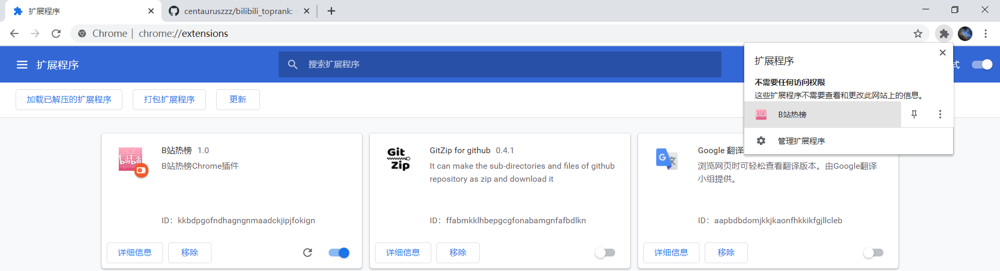

# bilibili_toprank
一款实时获取B站热榜的Chrome插件


## 食用指南

* 将项目clone到本地

```markdown
git clone git@github.com:centauruszzz/bilibili_toprank
```


* 打开Chrome浏览器的设置->更多工具->扩展程序


* 开启开发者模式


* 选择“加载已解压的扩展程序”，选择本地的bilibili_popular文件夹
* 点击右上角bilibili图标，就可以使用啦

